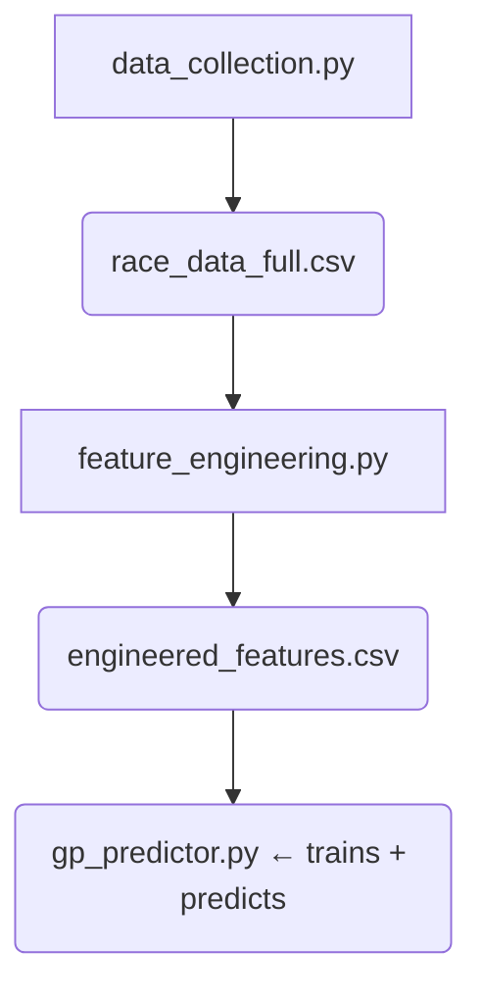

# 🏎️ F1 Grand Prix Predictor

Single‑script pipeline that

1. trains several regressors (Gradient Boosting, Lasso, MLP),  
2. benchmarks them on a fixed train/test split, **and**  
3. produces a ranking / winner prediction for the next Grand Prix,

using only pre‑race information (qualifying laps, grid slot, historical
performance, tyre strategy, weather, etc.).

---

## 1 Project layout
```text
.
├── data_collection.py        ← grabs raw lap & weather data from FastF1
├── feature_engineering.py    ← turns raw laps into driver‑race features
├── engineered_features.csv   ← output feature table
├── gp_predictor.py           ← trains, benchmarks and predicts GP results
├── qualifying_*.csv          ← minimal quali sheets (Driver, LapTime [,No])
└── cache/                    ← FastF1 disk cache
```

## 2 Key engineered features

| column                              | meaning                                                                     |
|-------------------------------------|-----------------------------------------------------------------------------|
| `best_quali_time`                   | fastest lap in the furthest Q‑session reached                               |
| `race_avg_lap` / `race_std_lap`     | mean / σ of race laps (target + variability)                                |
| `num_stops`, `avg_stint_len`        | pit‑stop strategy proxies                                                   |
| tyre fractions (`pct_soft` …)       | share of race laps on each compound                                         |
| `pct_caution_laps`, `pct_rain_laps` | race interruptions & weather                                                |
| `start_grid`, `pos_change`          | grid slot & race gain / loss                                                |
| **`season_avg_pos_delta`**          | running average of `pos_change` for the current season                      |

Sparse columns (> 70 % NaN) are dropped automatically.

## 3 Workflow



### 3.1 Download / refresh raw data
```bash
python data_collection.py           # (2024 – 2025 races by default)
```

### 3.2 Generate features
```bash
python feature_engineering.py
# or inject a minimal quali table for the current GP:
python feature_engineering.py --mini-q qualifying_saudi.csv --year 2025 --round 4
```

### 3.3 Train, benchmark, and predict
```bash
python gp_predictor.py  # training + metrics only
python gp_predictor.py --quali_csv qualifying_saudi.csv  # training + metrics + prediction
```

`qualifying_saudi.csv` needs only Driver, Driver No., and fastest recorded qualifying lap time:
```csv
Driver,No,LapTime
Max Verstappen,1,87.294
Oscar Piastri,81,87.304
...
```
The script auto‑fills **`season_avg_pos_delta`** - how much a driver's final placement changes from grid placement - from the latest engineered CSV.
Unknown drivers default to the training‑set mean (~0).

---

## 4 Environment

```bash
python -m venv venv
source venv/bin/activate          # or venv\Scripts\activate on Windows
pip install -r requirements.txt
```

`requirements.txt:`
```
fastf1>=3.0
pandas
numpy
scikit-learn
joblib
matplotlib
```

FastF1 uses the `./cache/` directory configured in `data_collection.py` for on‑disk caching.

---

Happy predicting!🏁
