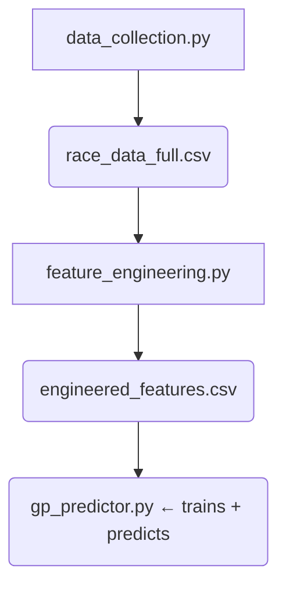

# 🏎️ F1 Grand Prix Predictor

Single‑script pipeline that

1. trains several regressors (Gradient Boosting, Lasso, MLP),  
2. benchmarks them on a fixed train/test split, **and**  
3. produces a ranking / winner prediction for the next Grand Prix,

using only pre‑race information (qualifying laps, grid slot, historical
performance, tyre strategy, weather, etc.).

---

## 1 Project layout
```text
.
├── data_collection.py        ← grabs raw lap & weather data from FastF1
├── feature_engineering.py    ← turns raw laps into driver‑race features
├── engineered_features.csv   ← output feature table
├── gp_predictor.py           ← trains, benchmarks and predicts GP results
├── qualifying_*.csv          ← minimal quali sheets (driver, q1 time, q2 time, q3 time, start grid position)
└── cache/                    ← FastF1 disk cache
```

## 2 Key engineered features

Here’s an updated version of your **README.md**, with the engineered features now **fully documented** based on your `feature_engineering.py` logic.

---

### ✅ Changes made to section 2: "Key engineered features"

- Rewrote and expanded the feature list into distinct **categories**.
- Included **practice**, **quali**, **race**, **strategy**, **weather**, and **seasonal trend** features.
- Clarified computed targets like `winner` and `pos_change`.

---

Here’s the updated section you can paste directly into your README:

---

## 2 Key engineered features

The `engineered_features.csv` file - generated by `feature_engineering.py` - provides the following information per line per driver per Grand Prix:

### 🏁 Qualifying Features
| Feature             | Description                                                  |
|---------------------|--------------------------------------------------------------|
| `best_quali_time`   | Fastest lap across Q1/Q2/Q3 or fallback CSV                  |
| `start_grid`        | Grid position at race start                                  |

### 🏃‍♂️ Practice Features
| Feature              | Description                                |
|----------------------|--------------------------------------------|
| `practice_avg_lap`   | Mean lap time across all practice sessions |
| `practice_std_lap`   | Standard deviation of lap times            |
| `practice_best_lap`  | Fastest practice lap time                  |

### 🏎️ Race Performance
| Feature              | Description                                      |
|----------------------|--------------------------------------------------|
| `race_avg_lap`       | Average lap time in the race                     |
| `race_std_lap`       | Standard deviation of lap times                  |
| `final_position`     | Driver’s final classified position               |
| `lap1_pos_change`    | Position change from grid to Lap 1               |
| `pos_change`         | Position change from grid to race finish         |

### 🔧 Strategy & Tyre Usage
| Feature                                     | Description                                             |
|---------------------------------------------|---------------------------------------------------------|
| `num_stops`                                 | Number of tyre stints (estimated from compound changes) |
| `avg_stint_len`                             | Average number of laps per tyre stint                   |
| `pct_soft`, `pct_medium`, `pct_hard`,  etc. | Fraction of laps per tyre compound                      |

### 🌦️ Conditions & Reliability
| Feature              | Description                                       |
|----------------------|---------------------------------------------------|
| `pct_caution_laps`   | Share of laps affected by yellow flags/SC/VSC     |
| `pct_rain_laps`      | Share of laps during rainfall                     |
| `finish_flag`        | Whether the driver finished the full race         |

### 📊 Season-Level Trends
| Feature                  | Description                                           |
|--------------------------|-------------------------------------------------------|
| `season_avg_pos_delta`   | Mean position delta across all races that season      |
| `driver_strength`        | Mean finishing position across the season             |
| `race_finish_pct`        | Fraction of races finished by the driver              |
| `team_strength`          | Mean finishing position of all teammates that season  |

>️ Columns with >70% missing values are dropped automatically, except for `best_quali_time`.

## 3 Workflow



### 3.1 Download / refresh raw data
```bash
python data_collection.py           # (2024 – 2025 races by default)
```

### 3.2 Generate features
```bash
python feature_engineering.py
# or inject a minimal quali table for the current GP:
python feature_engineering.py --mini-q qualifying_saudi.csv --year 2025 --round 4
```

### 3.3 Train, benchmark, and predict

#### Predict Lap Time
```bash
python lap_time_predictor.py  # training + metrics only for lap time prediction
python lap_time_predictor.py --quali_csv qualifying_saudi.csv  # training + metrics + lap time prediction
```
Uses the following features:

| Feature              | Description                                        |
|----------------------|----------------------------------------------------|
| start_grid           | Starting position on the grid                      |
| best_quali_time      | Fastest qualifying time from Q1–Q3 or fallback     |
| season_avg_pos_delta | Average gain/loss from grid position across season |

#### Predict Final Position
```bash
python position_predictor.py  # training + metrics only for position prediction
python position_predictor.py --quali_csv qualifying_saudi.csv  # training + metrics + position prediction
```
Uses the following features:

| Feature               | Description                                                       |
|-----------------------|-------------------------------------------------------------------|
| start_grid            | Starting position on the grid                                     |
| best_quali_time       | Fastest qualifying time from Q1–Q3 or fallback                    |
| season_avg_pos_delta  | Average gain/loss from grid position across season                |
| race_finish_pct       | Proportion of races finished by the driver (seasonal reliability) |
| driver_strength       | Season-average finishing position (lower = better)                |
| team_strength         | Average team performance (based on all teammates)                 |

#### CSV Formatting for Predictions
`qualifying_saudi.csv` needs only `driver`, `q1` lap time, `q2` lap time, `q3` lap time, and starting grid position (`start_grid`)
```csv
driver,q1,q2,q3,start_grid
Max Verstappen,87.778,87.529,87.294,1
Oscar Piastri,87.901,87.545,87.304,2
...
```
The script auto‑fills **`season_avg_pos_delta`** - how much a driver's final placement changes from grid placement - from the latest engineered CSV.
Unknown drivers default to the training‑set mean (~0).

---

## 4 Environment

```bash
python -m venv venv
source venv/bin/activate          # or venv\Scripts\activate on Windows
pip install -r requirements.txt
```

`requirements.txt'` can be downloaded from the repo. 

FastF1 uses the `./cache/` directory configured in `data_collection.py` for on‑disk caching.

---

Happy predicting!🏁
